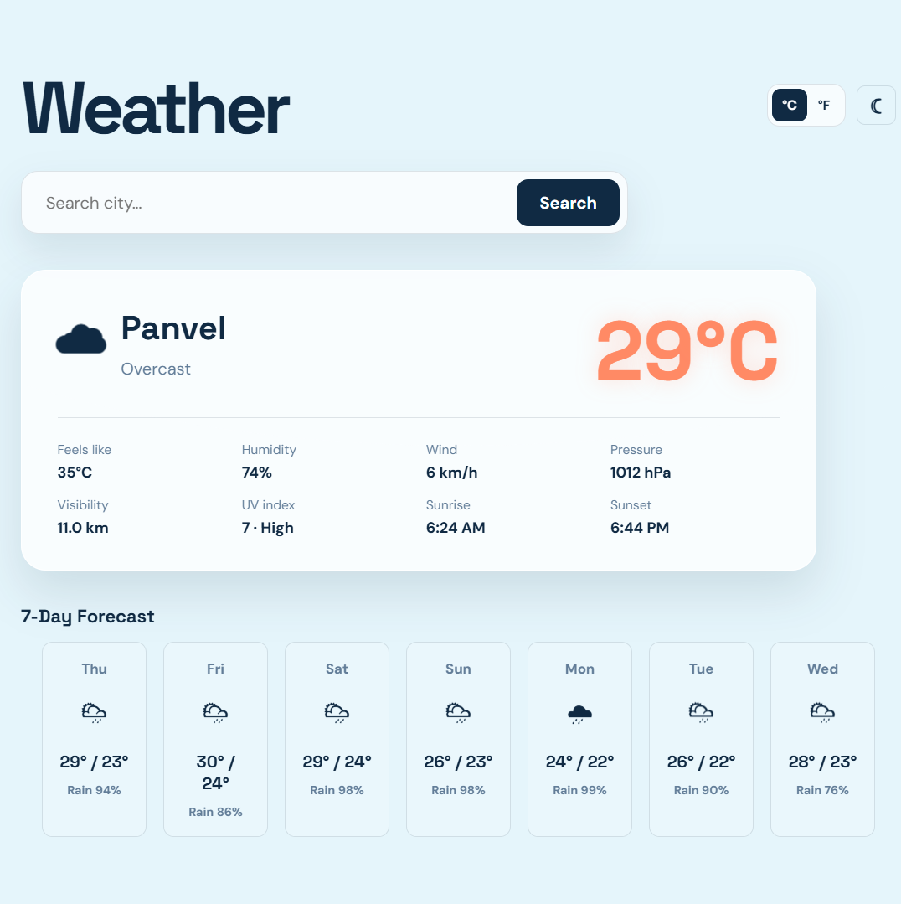

# Weather App

A responsive weather dashboard built with React and Vite. Search for any city to see current conditions, a seven-day forecast, temperature units, recent searches, and a light or dark display mode.



## Live Demo

Visit the deployed app at [rhande427-oss.github.io/weather-app](https://rhande427-oss.github.io/weather-app/).

Run the app locally and open `http://localhost:3000` in your browser:

```bash
npm install
npm run dev
```

## Features

- Search weather by city name
- Current temperature, feels-like temperature, humidity, wind, pressure, visibility, UV index, sunrise, and sunset
- Seven-day forecast with precipitation probability
- Celsius and Fahrenheit units
- Recent search history stored in the browser
- Light and dark display modes
- Weather-aware animated presentation

## Tech Stack

- React 18
- Vite
- Open-Meteo Geocoding API
- Open-Meteo Forecast API

## Production Build

```bash
npm run build
npm run preview
```

The app uses the public Open-Meteo APIs, so no API key is required.
